# Prompt Y — flashcard homework, one proper run-through (4 Oct 2026)

Mide's brief: play every path as a pupil and every view as a teacher, on TEST
with data shaped like production, at phone and desktop sizes, light and dark;
fix every fault at the source; start with the phone typing screen.

**What shipped (all live on mrbadmus.com, verified by md5 against the commit):**

| unit | commit | what |
|---|---|---|
| 1 | `678aa5bfd` | the phone typing screen; one-word answers; subscripts in the learn step |
| 2 | `b2e8e5b8e` | two tabs; double taps; "revised after marking" on a deck; the run-through rig |
| 3 | the commit that adds this report | the learn step's question colour on the card (a unit 1 fault I caught in review, live for about two hours); this report |

**Parked for Mide:** one SQL migration, branch `feat/y-migrations` (below).
**No edge-function change.** `flashcard-answer-check` v4 on production is the
repo's file byte for byte; nothing in this run needs it redeployed.

---

## 1. The phone typing screen

### What was wrong (both of Mide's points were real)

1. **"It isn't obvious where to type."** After "I don't know", the cursor was
   nowhere: focus fell to the page itself, so the keyboard did not open and
   the box was a faint cream rectangle on a cream page (its border measured
   2.05:1 in light, 1.70:1 in dark — below the 3:1 a control needs).
2. **"The keyboard covers the answer."** Under a real keyboard the card
   scrolled from the top, so the QUESTION took the room and the model answer
   sat below the fold. On a production-length card at iPhone size only one
   and a half lines of the answer showed.

A third fault was in the proof itself: the old layout check *accepted* the
bug ("answer visible: not required"), exempted the 360px phone, and took its
screenshots after it had scrolled the card itself. It passed on a broken
screen. It has been rewritten, and it now fails 5–10 checks per device on the
old code.

### What it does now

- Tapping "I don't know" puts the cursor in the box **inside that tap** —
  the only moment iOS will open the keyboard for a page — and keeps it there
  through the redraw.
- With the keyboard up, the **answer is what's on screen**: the question
  steps down to small grey-blue text (and scrolls up out of the way, a line
  at a time, when room is short); if even then the whole answer doesn't fit,
  the answer's first line sits at the top of the card and the rest scrolls.
  The box keeps three lines, or two at the very least, and Check sits just
  above the keyboard.
- The box looks like a box: a clear border at rest (6.4:1 light, 8.7:1
  dark), and an orange border, ring and cursor when you're typing in it.
- The smaller question is drawn in the card's own grey-blue (6.6:1). Unit 1
  first shipped it in the PAGE's grey, which on the dark card read 1.8:1 —
  too faint for a Year 10. I caught it reviewing the Android pictures;
  unit 3 fixed it, and the layout check now measures it in light and dark.
- If a pupil scrolls the card up to re-read the question, it stays where they
  put it while they type.
- No new words on screen.

### Before and after — keyboard up, the "I don't know" step

The card is production's own: *"Explain the effect adding a catalyst has on
the rate of a reaction."* → *"Increases the rate of reaction by providing an
alternative reaction pathway with a lower activation energy"*. Pictures are
cropped to what is visible above the keyboard.

| size | before (main, 4 Oct) | after |
|---|---|---|
| iPhone 390×844 | 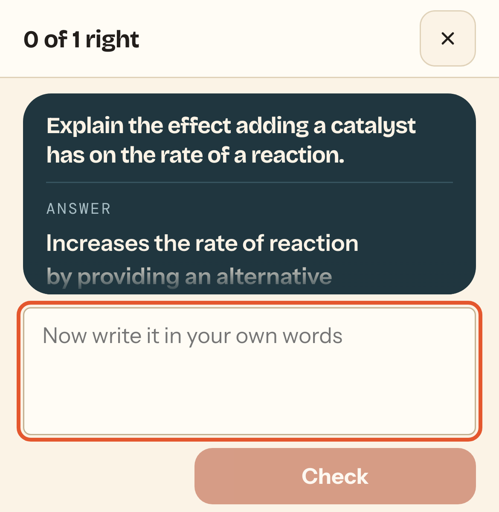 | 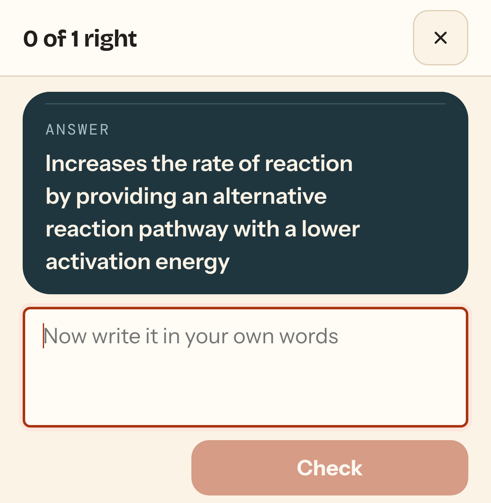 |
| iPhone 390×844, dark | 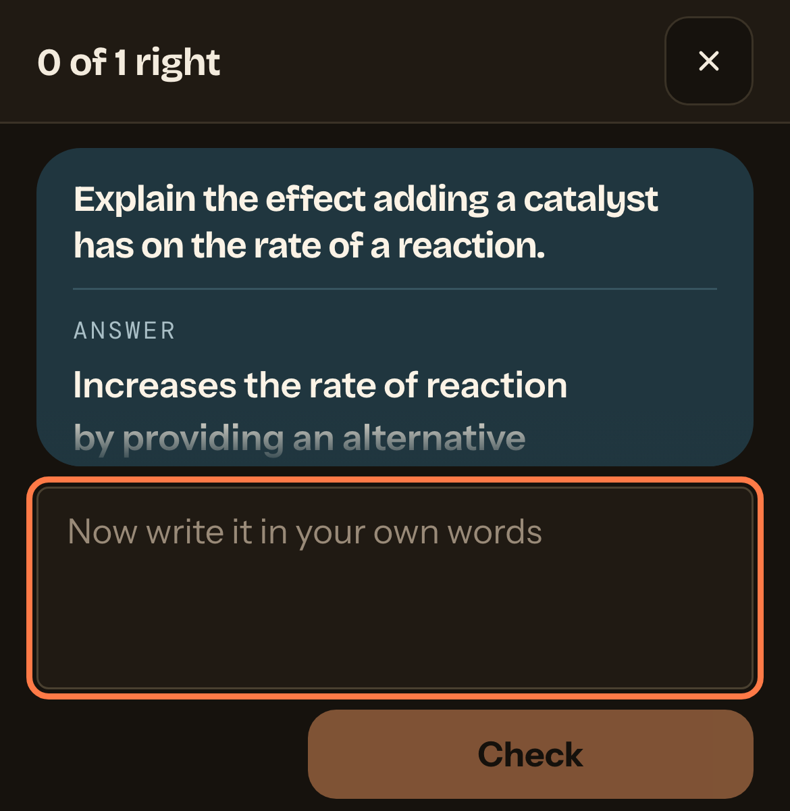 |  |
| small iPhone 360×740 | 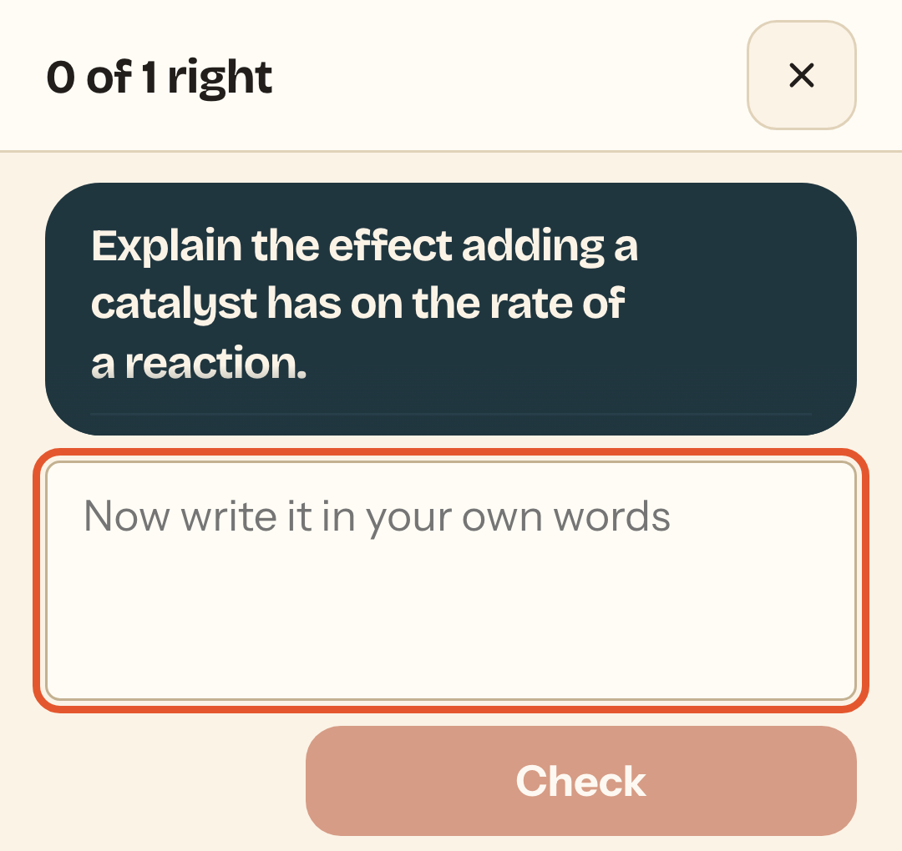 |  |
| Android 412×915 | 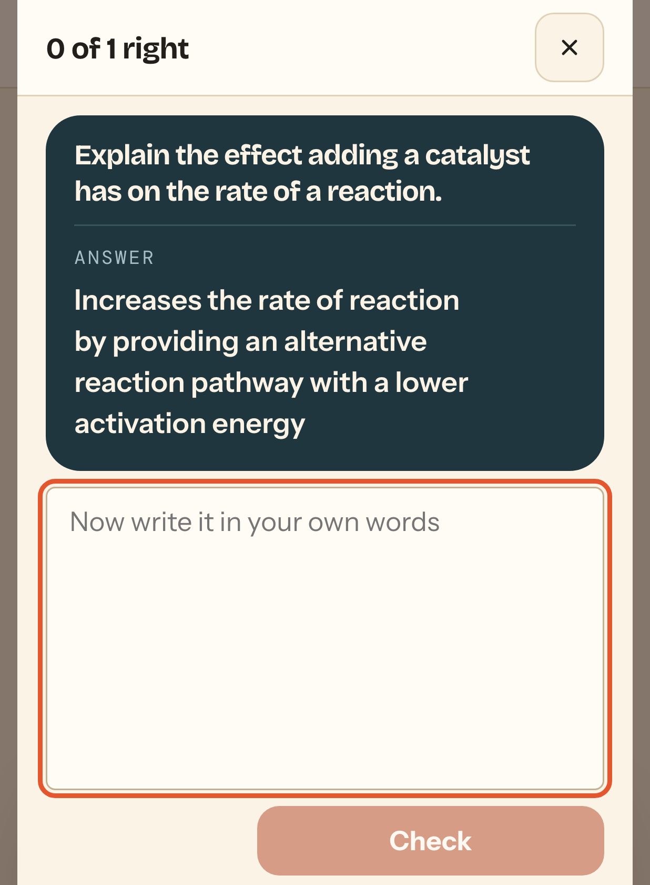 |  |
| Android 360×800 | 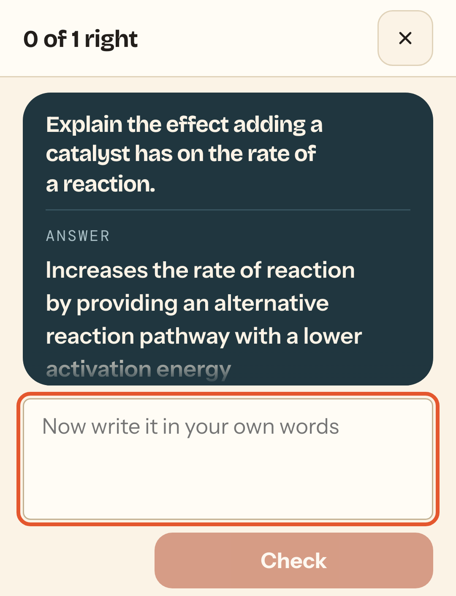 | 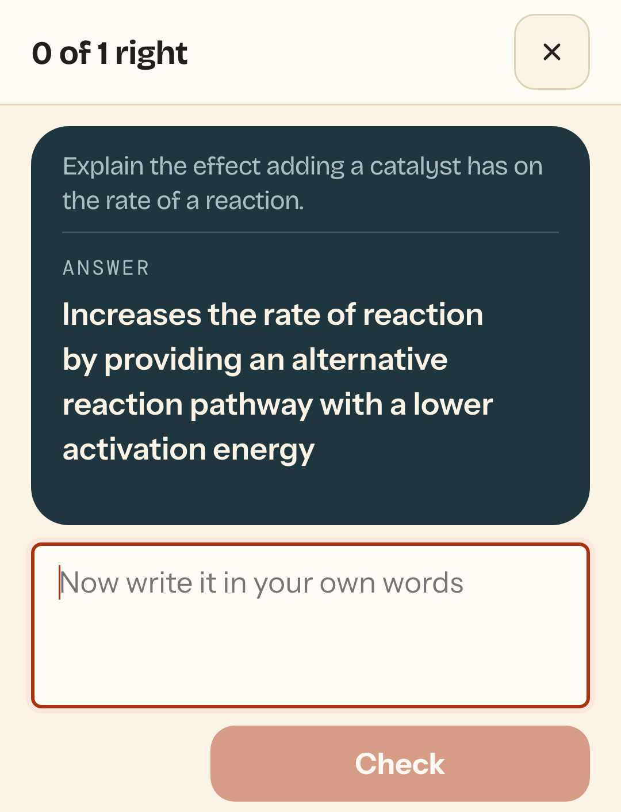 |

**How the keyboard was simulated — read this.** This machine has no iPhone,
no iOS Simulator (no Xcode, and not enough disk for it) and no Android
emulator. So: Chrome, at each phone's size, with the keyboard simulated the
way each phone really reports it — iOS shrinks only the *visible* area
(`visualViewport`, at the heights Safari leaves with its keyboard and form
bar up: ~400px on a 390×844 phone, ~340px on a 360×740), also with the page
nudged 40px as Safari does when it scrolls to the box; Android Chrome, under
this page's settings, shrinks the whole page (~560px and ~470px). That is the
best available stand-in, not a phone. **The iPhone check at the end of this
report is the real test.**

`tools/flashcard_phone_layout.py`: 392 checks across the four phones, light
and dark, short / production-length / very long answers, a chemistry
formula, and the normal (not "I don't know") card. 0 fail. On the old code
the same checks fail 5–10 per phone (cursor not in the box, answer cut off,
faint border, no focus ring).

---

## 2. The run-through

`tools/y_runthrough_live.py` drives the REAL class page and teacher pages
against TEST, with a throwaway school, a 25-pupil class named the way
production names them, and decks copied from production's own (Rate of
Reaction, Energy, Organic Chemistry wording) plus edge decks. The answer
check is the committed `flashcard-answer-check` function run for real, with
only the AI model swapped for a stand-in (anything containing "half" →
Nearly, "wrong" → Wrong, otherwise Right). Every run deletes exactly the
rows it made (0 left behind, every run).

| path / edge | what I did | what happened | result |
|---|---|---|---|
| Typed right first time | typed the model answer, Check | "Right", Secured filled | pass |
| "I don't know" → learn → Nearly → comes back → right → Secured | I don't know; typed the shown answer; Check | answer shown under the question; capped at Nearly (Secured not offered); card came back before the pass ended; typed right → Secured | pass |
| Nearly → sees answer → comes back → right | typed a half answer | "Nearly"; only Nearly / Not yet offered; model answer shown; came back; right → Secured | pass |
| Wrong / blank → Not yet only | typed "something wrong…", then "idk" | "Wrong" / "No answer"; only Not yet offered | pass |
| Done = every card secured; end screen | finished with leftovers, then without | "7 of 10 secured" + Try again only (replays only the leftovers); then "10 of 10 secured" + Done + "Revise flashcards one more time" | pass |
| Revise one more time | Revise after Done | a fresh pass; nothing un-secured; homework stays done | pass |
| One word, four states | scanned every page visited (text, labels, tooltips) and the CSV | "Got it" nowhere; only Secured · Nearly · Not yet · Not seen | pass |
| ‹ Back and Forward › on every card | 10-card deck: 9 Backs to card 1, 9 Forwards to card 10 | each press one card; no Back on card 1, no Forward on the newest; no rating changed | pass |
| Back after a card is secured | Back onto a secured card, answered it wrong | it becomes Not yet — pupil strip "8 of 10" and the teacher both say so | as designed (see "not sure" 3) |
| Kill the tab mid-deck | after 4 cards; and mid-typing a half answer (the tab's process killed, the phone's storage kept) | reopens on card 5; the half-typed words are back in the box | pass |
| Another device | reopened on a fresh browser | right card; half-typed words not carried (they live on the device that typed them — by design) | pass |
| Reopen finished homework → teacher sees it | finished, then Revise | **was a fault:** the teacher never saw "revised after marking" for a deck. **Fixed (unit 2)** — now shown | fixed |
| History "First try" / "Later tries" | teacher's pupil panel, "Pupils write the answers" deck | both labels, correct rows | pass |
| Teacher numbers agree | class card, class page, progress page, pupil panel, CSV, database | 10/10 secured everywhere, same four-state counts | pass |
| One-card deck | finished it | "1 of 1 secured", Done | pass |
| 40-card deck | opened and played every card | opens in ~2 s; "40 of 40 secured" | pass |
| Very long answers (400–600 characters) | phone, no keyboard | readable, nothing cut mid-line, Check reachable | pass |
| Formulae | chemistry deck, dark: CO2, H2SO4, CH4, Na2CO3 | real subscripts on the card, the back and "your answer"; typing flat "CO2" is still right | pass |
| Formulae on a non-chemistry deck | physics card "Newton's second law (N2)" | no subscript (correct). **The "I don't know" answer and "your answer" used to subscript it — fixed (unit 1)** | fixed |
| Slow answer check (6 s) / failed (error 500) | answers routed slow / failing | after the 4 s wait no verdict shows and all three ratings are offered, so the pupil rates themselves | works as built — see "not sure" 1 |
| Double-tapping every button | two clicks in the same instant on each control | **was a fault:** ‹ Back / Forward › moved two cards. **Fixed (unit 2)** — one press per screen; two real taps still count twice | fixed |
| Two tabs open at once | secured card 1 in tab A, switched to tab B (opened earlier) | **was a fault:** tab B offered card 1 again, and a wrong answer there **un-secured it on the server** (the teacher saw it not secured). **Fixed (unit 2)** — a tab catches up the moment you switch to it; card 1 stays secured (6 of 6 runs) | fixed |
| One-word answers | typed "energy" for *"Define activation energy."* | **was a fault:** any single word that appears in the model answer was marked Right, and Right is Secured — a pupil could secure a whole deck one word at a time. **Fixed (unit 1 + parked SQL)** — a single word is Right on the spot only when it IS the answer ("joules" for "Joules (J)"); anything else goes to the AI check | fixed |
| The two deck modes | played "Pupils write the answers" and "Ready-made cards" | both play as before; nothing changed | pass |
| Sizes and themes | the core paths at 390 light, 390 dark, 360 dark, desktop light, desktop dark; the teacher pages at 390 light/dark and 1440 dark | the same results in every view; no sideways scrolling; contrast checked | pass |

---

## 3. Parked SQL — `feat/y-migrations` (NOT applied to production)

One function, `flashcard_quick_check` — the instant check for blank /
one-word answers. The site already uses the new rule; this makes the
database agree, so the teacher sees the verdict the pupil saw. **Until it is
applied, the only difference is that for a one-word answer the teacher may
see the old instant verdict while the pupil saw the AI's.**

| | md5 |
|---|---|
| migration `supabase/migrations/20261004120000_y_quick_check_key_word.sql` | `e3718847dc59015b48ea78ad19bc699e` |
| rollback `supabase/rollbacks/20261004120000_y_quick_check_key_word_rollback.sql` | `51237aa3996922a3abf550e6321c9caa` |
| function body BEFORE (production today) | `e7115d4ab2090efa95187e6dd6abc3d3` |
| function body AFTER | `ab1d58c567c4ad5d6b7674154011fe20` |

Built by script from production's own bytes, not retyped. Rehearsed on TEST:
apply → `ab1d58c5` → rollback → `e7115d4a` (production's exact bytes) →
apply again; TEST is left on the new body. All 88 test cases agree between
the site and the SQL. Apply sheet: `supabase/Y-APPLY.md` on that branch.

Production's other flashcard functions, read 4 Oct before any work (all
untouched by this run): `flashcard_card_state` `eb50f6a2…`,
`flashcard_record` `9f910628…`, `flashcard_store_verdict` `4ea8f0e1…`,
`flashcard_pupil_detail` `ad73dae2…` — exactly the bodies the brief named.

---

## 4. Things I wasn't sure about — for Mide to see before he finds them

1. *(Decided by Mide, 4 Oct — option B, see §6.2.)* **A slow or failed AI check lets the pupil rate themselves.** If the
   check takes more than 4 seconds or fails, the pupil sees the answer and
   picks Not yet / Nearly / Secured themselves, with nothing filled in.
   Production's own numbers: 2 of the last 73 checks (~3%) were slower than
   4 s. Capping these at Nearly would stop anyone being Secured on an
   unchecked answer — but if the AI were ever down, nobody could finish
   their homework. I left it; it's your call.
2. **One-word answers now wait for the AI.** "joules" for "Joules (J)" is
   still instant. "Mitochondria" for *"Where does respiration happen?"*
   (model answer "Mitochondria are where respiration happens") now goes to
   the AI, which should say Right — but I could not run the real AI here (no
   key on this machine); the run used the stand-in. Worth one look on your
   phone with a one-word answer.
3. *(Decided by Mide, 4 Oct — once secured, stays secured, see §6.3.)* **Going ‹ Back to a secured card and answering it wrong un-secures it.**
   That is the rule MRB-354 built ("Back in the same sitting can still change
   a rating"), and the pupil and the teacher agree on it — but your 2 Oct
   rule doesn't say, and a pupil could hit it by checking themselves.
4. **Two tabs:** a tab catches up when you switch to it. If a pupil somehow
   answers in BOTH tabs within the same second, the later answer counts —
   there is no way round that without the server telling tabs apart.
5. **Two gates were already red on main** from the KS4 route-flags merge
   (`frozen_window_guard`: 96 KS4 subtopics differ in triple-only;
   `curriculum_tree_mirror`: `consumer/curriculum-index.json` out of date).
   Not mine, not flashcards, and fixing them touches frozen KS4 content and a
   B2C file — both outside this brief. Recorded as inherited in the unit 1
   commit message. They need whoever owns the route flags.
6. **Gates that could not run here:** `student_controls_drive` (needs a
   production password), `set_work` and `student_bell_drive` (need their own
   TEST passwords) — reported as SKIPPED by name, never as passes.
7. **Interrupted once.** This session was killed partway (the machine ran
   out of memory with two builders and Chrome at once). Nothing was lost;
   the rest was run one Chrome at a time.

---

## 5. On your iPhone

Sign in on Safari as your own pupil test account (the one in the test class
**8r/Sc1**), go to your class page, and open the homework **"Organic Chemistry Quiz" (due Fri 9 Oct)**.
You've already finished it, so you'll see "10 of 10 secured". Tap **Revise
flashcards one more time**.

On the first card that comes up, **don't type anything — tap "I don't
know"**. What you should see, with no further taps:

1. **The keyboard opens by itself**, and the cursor is blinking inside the
   box, which now has an orange border.
2. **Above the box, the answer is in full** — e.g. for *"Describe how crude
   oil is formed."*: *"Plankton died, were buried under sediment and
   compressed via heat and pressure over millions of years"* — in large
   white text. The question sits above it, smaller and grey-blue; on a
   smaller phone it may have scrolled up out of view (swipe the card down to
   see it, and it stays where you put it).
3. **Check is just above the keyboard**, not under it.
4. Type the answer and tap Check: Nearly is filled in and Secured isn't
   offered. Tap Nearly; that card comes back later in the pass.

Then, as the teacher of 8r/Sc1, open that pupil's page (8r/Sc1 → the
pupil): once you've rated at least one card in that Revise pass, the Organic
Chemistry Quiz row says **"revised after marking"**.

If step 1 or 2 doesn't happen, that is exactly what I could not test
without a real iPhone — please send me a screenshot.

---

## 6. Mide's 4 Oct decisions

Mide tried the phone screen on his iPhone and made three decisions. The lane
had already applied the one-word SQL to production (`flashcard_quick_check`
`ab1d58c5…`, spot-checked live). Everything below is built on production's
current bodies, read again on 4 Oct before any work.

### 6.1 Don't open the keyboard straight away

> "Students should be able to see and digest the answer first, and then type
> the answer in the answer box."

**What changed.** "I don't know" no longer puts the cursor in the box; it
lets go of focus instead, so even a pupil who had already tapped into the
box gets the keyboard put away. The model answer has the screen, big
(18px+), with the box plainly under it (the same 2px border) and Check in
view. No new words. When the pupil taps the box, the keyboard comes up and
the layout is exactly what Mide tested: the answer above the box, the orange
border, the question small and scrollable, Check above the keyboard. Before
the tap the card is answer-first too: if the question and the whole answer
don't fit, the card starts at the answer, and no line is ever cut at its
edge. After a Nearly / Wrong there is no box at all (the answer shows on the
back of the card with the ratings), so there is no keyboard there either.

**Proof.** `tools/flashcard_phone_layout.py` now checks, on the four phones in
light and dark: the cursor is not in the box during the "I don't know" tap or
after the redraw (it starts with the box focused, the worst case); at rest
the whole answer is on the card (a very long one starts at the card's top),
the answer is at least 17px, the box (≥60px) and Check are on screen, no line
is cut; then, after the tap, every keyboard check from before. **506 checks,
0 fail.** On yesterday's page the same tool fails: "'I don't know' does not
put the cursor in the box (activeElement='answer')", "nor does the redraw",
"at rest, nothing is focused".

| phone | 1. after "I don't know" — no keyboard | 2. after tapping the box |
|---|---|---|
| iPhone 390×844 | 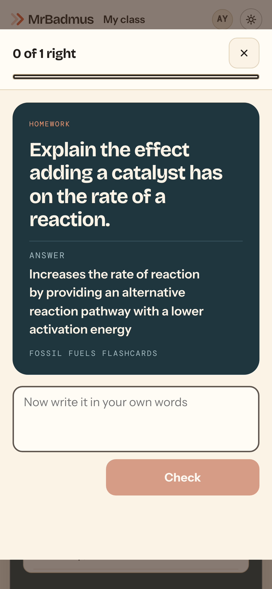 | 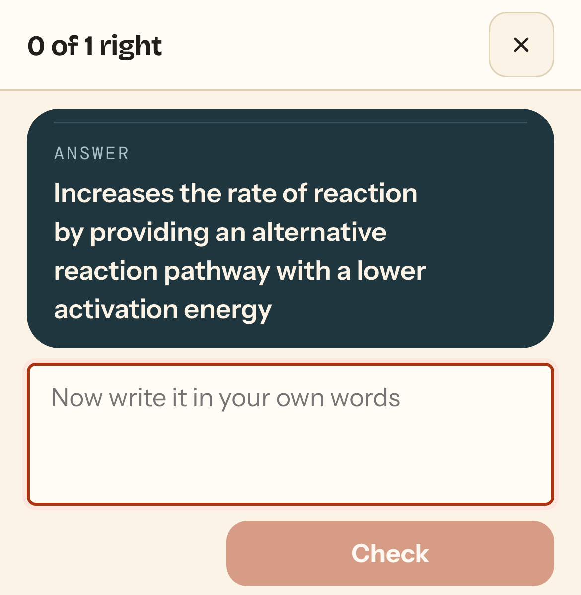 |
| iPhone 390×844, dark | 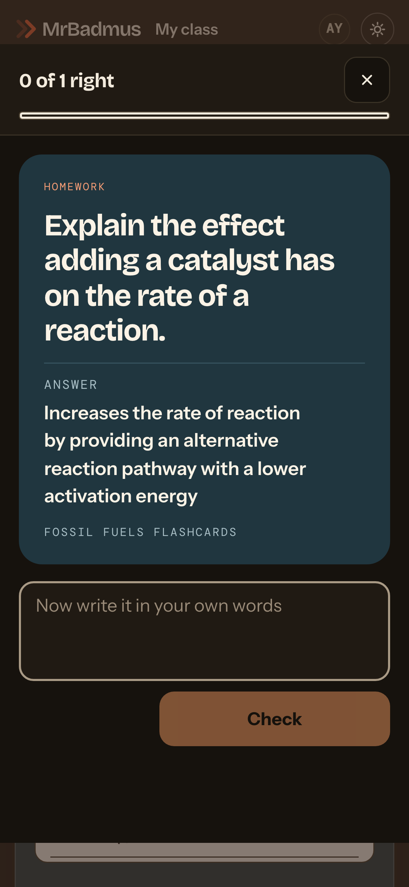 | 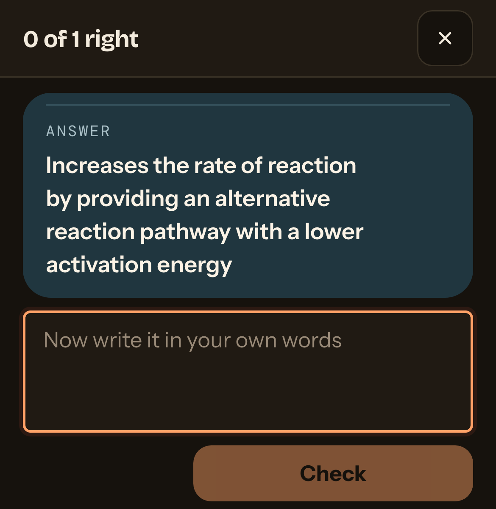 |
| small iPhone 360×740 | 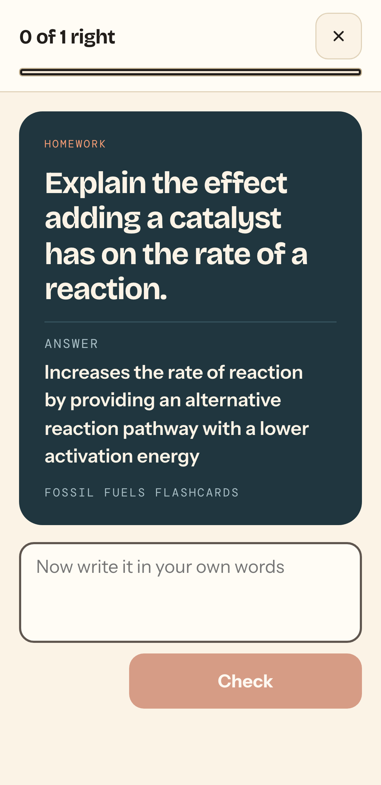 | 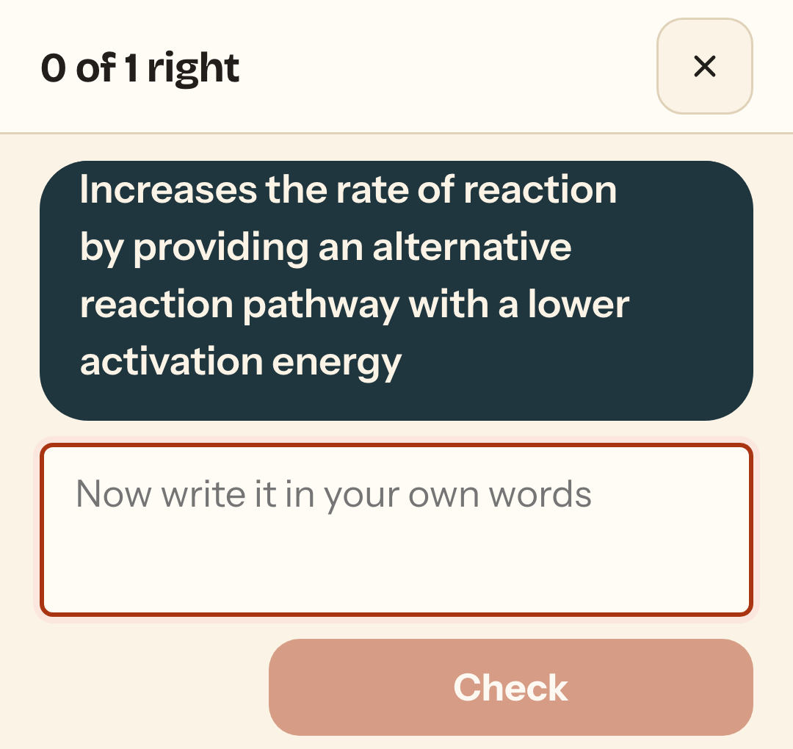 |
| Android 412×915 | 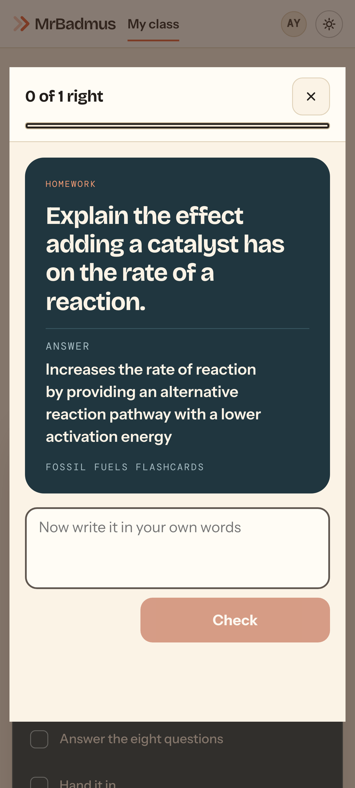 | 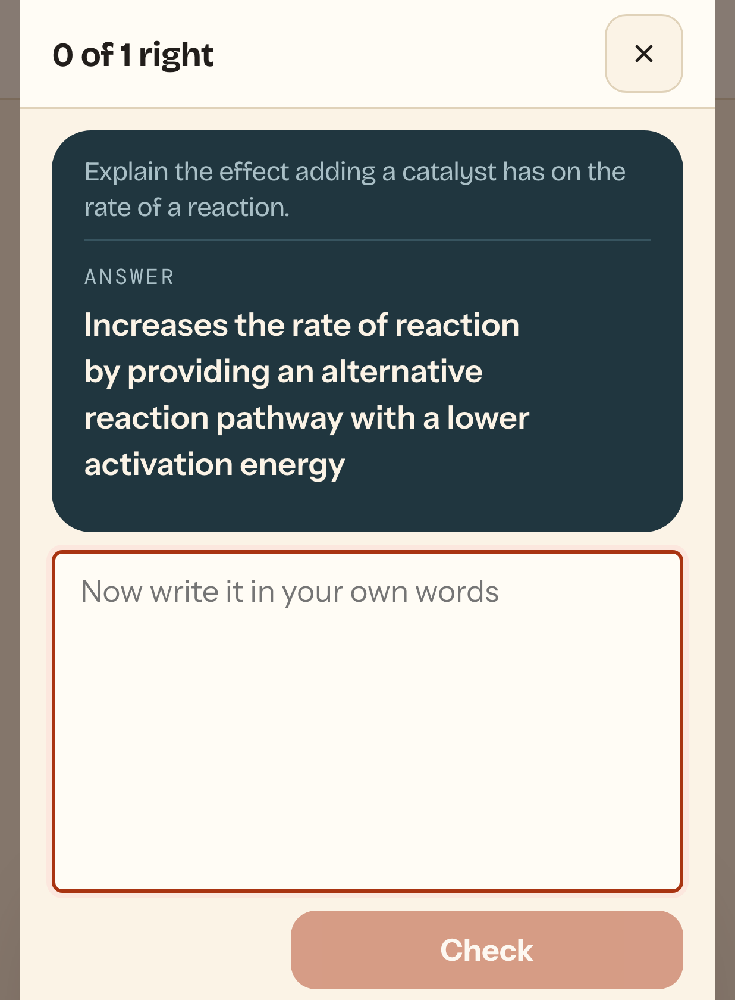 |
| Android 360×800 | 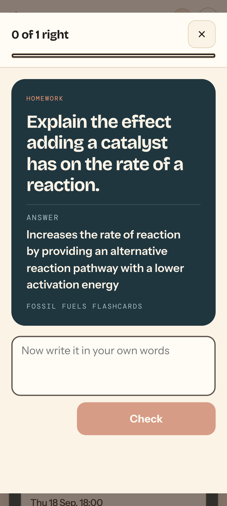 |  |

(The "after tapping" pictures are cropped to what is above the keyboard; the
keyboard is simulated, as in section 1.)

### 6.2 Slow or failed AI check → never Secured (option B)

> "Secured has to mean secured."

**What changed.** The check now makes one quiet retry: if no verdict comes
within 4 seconds, it asks again (the pupil just keeps seeing "Checking…"),
for up to 4 more. The retry usually gets the verdict the first, slow call has
just stored on the server, or a fresh one. Only if the retry also comes back
empty is the answer unchecked, and then the pupil may choose **Nearly or Not
yet, never Secured**. Nearly brings the card back at Try again, where it is
checked properly. Nothing is filled in for them and no words are added.

**Proof.** Engine tests: a slow first reply still "Checking…" during the
retry; both waits over → capped at Nearly; a malformed reply twice → capped.
On TEST with the real answer-check function (`--phases slowfail`): one slow
reply (6 s) → "Checking…" at 4.6 s, then **"Right" at 7.7 s**; a failing check
(500 twice) → no chip, **only Nearly / Not yet**; the deck ends "2 of 3
secured", Try again brings that card back, it is **really checked** and
secured → "3 of 3 secured", Done.

No SQL, no edge-function change: the server already records whatever rating
the pupil gives, and the cap lives on the page with every other verdict cap.

### 6.3 Once secured, stays secured

> "Once secured, stays secured. It also helps with students not losing
> motivation."

**What changed — every place that could lower a secured card was checked:**

| place | before | now |
|---|---|---|
| the pupil's page (`securedInfo`, the live tally) | the latest rating per card per sitting counted | any Secured ever counts; a later lower rating is kept as history |
| `flashcard_card_state` (the teacher's Secured, every teacher page) | same "latest" rule | any Secured ever — **parked SQL below** |
| `flashcard_record` (when the homework counts as finished) | finish walk over the latest ratings | every Secured rating — **parked SQL below** |
| `flashcard_pupil_detail` | reads `flashcard_card_state`; lists every rating | no change needed; the later attempt shows in "Later tries" |
| `flashcard_progress` | reads `flashcard_card_state` | no change needed |
| `flashcard_store_verdict` | writes verdicts, never ratings | no change needed |
| the two-tab catch-up | rebuilds from the pupil's rows with the page's rule | follows the page's new rule; cannot lower a card |

**Proof.** Engine tests: a redo answered wrong leaves the card secured and the
deck goes to Done (the Not yet is still an event); ‹ Back + wrong in the same
sitting keeps the finish time; a wrong answer in a Revise pass after Done
leaves all five secured. On TEST (`--phases backwalk`, the new SQL in place):
‹ Back to a secured card, answered wrong → only Not yet offered; the pupil
still ends "10 of 10 secured", Done; the teacher's pupil detail shows the card
**Secured, history `got_it, not_yet`**. With production's current SQL put back
on TEST, the same run shows the teacher "not secured" — which is what
production will show for such a card until the migration below is applied.

### Parked SQL — `feat/y2-migrations` (NOT applied to production)

| | md5 |
|---|---|
| migration `supabase/migrations/20261004180000_y2_secured_stays_secured.sql` | `151e29b5c38522226a2252e1cededdff` |
| rollback `supabase/rollbacks/20261004180000_y2_secured_stays_secured_rollback.sql` | `b18864861c7cf69f920509843d2da85e` |
| `flashcard_card_state` BEFORE (production) → AFTER | `eb50f6a2648e23a26af93ab3691ddc65` → `ec4834b787ec5c7e4b3408c9876457bb` |
| `flashcard_record` BEFORE (production) → AFTER | `9f9106282729fcd97c8975983a880cb0` → `118ade9a51a976365626b3aa67e91e56` |

Built from production's own bytes (the committed migration files whose bodies
md5-match production), one filter changed in each. Rehearsed on TEST: apply →
rollback (production's exact md5s) → apply; grants unchanged throughout; TEST
left applied. Apply sheet: `supabase/Y2-APPLY.md` on that branch. **Apply it
with, or soon after, the site push** — until then a card secured and then
answered wrong reads Secured to the pupil and not secured to the teacher.

### Also re-run on the final code

Every run-through phase on TEST, one at a time: the core paths (48 checks),
two tabs (14), double taps (18), kill-tab (12), the teacher views at three
sizes (65), review mode (22), formulae (23), edge decks (22), slow/fail,
Back/Forward on every card — all pass, 0 rows left behind. Engine tests 191/0;
the homework drive green.

### On your iPhone — what you should see now

Same steps: your pupil test account → **8r/Sc1** → **"Organic Chemistry
Quiz" (due Fri 9 Oct)** → **Revise flashcards one more time** → on the first
card, without typing, tap **"I don't know"**.

1. **No keyboard.** The model answer is on the card, big and white, under the
   question (or at the top of the card, if there isn't room for both). The
   box sits below it with its grey border, no cursor in it, and Check is in
   view. Nothing tells you what to do; you read the answer.
2. **Tap the box.** The keyboard comes up, and the screen becomes the one you
   tested and liked: the answer above the box, the box's border turns
   orange with the cursor in it, the question small and grey-blue (scroll
   the card down to see it if it has gone), and Check just above the
   keyboard.
3. Type it and tap Check: Nearly is filled in and Secured isn't offered — the
   card comes back later in the pass.
