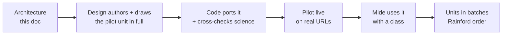

# KS4 Lessons — Rebuild Architecture

Sep 24, 2026 · @Mide Badmus

## The short answer

KS4 lessons get the same teaching engine as KS3, retuned for an exam. Every one of the 264 GCSE lessons becomes a chain of short explain-then-do cycles with real instruments. The page ends in an exam ladder that trains what AQA actually awards marks for, not a wall of text with a quiz stapled on.

- **The unit of work stays the subtopic:** one lesson, one idea, one page. That's 264 lessons (Biology 89, Chemistry 93, Physics 82), rendered as \~865 pages across Combined/Triple and Foundation/Higher.
- **One lesson serves all four routes.** Higher-only and Triple-only material are layers inside the same lesson, not separate pages written four times.
- **The pedagogy is already settled,** in two places: the July bonding council (written for KS4) and the KS3 architecture (the same thinking, proven across 185 lessons). This document merges them for GCSE. It invents very little.
- **Order of work:** this architecture, then Design authors and draws the pilot unit in full (the lessons themselves, not a template), then Code ports it to the live site and cross-checks the science, then the other units in batches. The same pipeline KS3 used, which is why the KS3 pages are as good as they are.

## What was agreed before

Three earlier decisions already fix most of this, and this rebuild follows them rather than reopening them.

| When | Where it lives | What it settled |
| --- | --- | --- |
| 19 Jul 2026 | Bonding council review (`docs/redesign/council_bonding_review.md`) | Your verdict, binding: *"One interactive at the top followed by loads of text does not work. Every page forced into one simple structure is lazy work."* Five experts reviewed the 12 bonding pages and agreed. Many ways to learn one topic on one page; the structure is driven by the topic. |
| 19 Jul 2026 | Bonding v2 architecture (`docs/redesign/architecture_v2.md`) | The ten laws for KS4 pages; five architecture families; the text strategy; the component tiers (TapMatch, PredictWrapper, ChainBuilder, WriteThenMark, FormulaDeducer and more). Written for GCSE chemistry. |
| 25 Jul – 30 Aug 2026 | KS3 architecture (`docs/ks3/architecture.md`) | Took bonding v2 and made it better for KS3: phenomenon first, misconceptions as required data, concrete to abstract, a closed 14-block vocabulary, seven families, the mastery ladder with all four rungs scored. Built across all 185 KS3 lessons. |
| 30 Aug 2026 | Linear MRB-304 | KS4 lesson pages still carry the old dark design. The plan was to wait for Design's lesson-page template, then port it. Design was never briefed with a pedagogical structure, so the template never came. |

So the missing piece isn't a pedagogy. It's a GCSE version of the KS3 architecture that Design can draw from, which is what this document is.

## Why KS4 is not KS3 with harder words

A GCSE pupil's real problem is a written exam against published mark schemes. So the lesson keeps KS3's engine but changes what it trains toward.

|  | KS3 | KS4 |
| --- | --- | --- |
| What the page is for | Build the concepts, confront the wrong idea | Same, **plus** turn it into marks on AQA 8464/8461-3 |
| Assessment at the end | Mastery ladder, plain-English success criteria | **Exam ladder**: mark tariffs, AQA command words, marking points |
| Who sees what | Everyone sees core; stretch is opt-in | Core for everyone; **Higher** and **Triple** content shown by route, never lost to Foundation pupils when AQA says it's base content |
| Practical work | Simulated investigations | Also **AQA's required practicals (21 in Combined, 28 across the separate sciences)**, which are directly examined |
| Maths | Light | **Equations and calculations** carry a large share of marks (Physics especially); rearranging and units are content |
| Extended writing | Explain rung | **4- and 6-mark answers** with levels-of-response marking |
| Prose budget | \~90 words before acting | **\~150 words** before acting (older readers; bonding v2's figure) |
| Page length | 25–40 minutes | 30–45 minutes, still one sitting |

What carries unchanged from KS3:

- phenomenon first;
- misconception confrontation;
- predict before reveal;
- worked/do pairs;
- concrete to abstract;
- vocabulary taught, not assumed;
- motion is meaning;
- no punishment mechanics;
- the closed block vocabulary;
- one design language.

## The ten KS4 laws

Every KS4 lesson is judged against these. A lesson that breaks one is a defect, not a style choice. Laws 1–5 and 8–10 are KS3's, retuned; 6 and 7 are GCSE-specific.

1. **Phenomenon first.** Open with something observed or a real exam-shaped scenario, never a definition. The definition arrives once the pupil wants it.
2. **The 150-word encode–act spine.** Never more than \~150 words of continuous text before the pupil commits to something: a prediction, a construction, a classification, a written answer. Whole-lesson body text under \~700 words.
3. **Misconception-targeted.** Every lesson names its misconceptions as data, and at least one activity confronts one head-on, at the moment the error is born.
4. **Predict before reveal.** No instrument shows a verdict the pupil hasn't bet on.
5. **Watch then do.** A worked example never ships without the pupil doing the same thing themselves. At KS4 that includes calculations (FIFA worked, then practice) and drawings (dot-and-cross, ray diagrams, circuits).
6. **Production is trained, not just recognised.** AQA pays for writing, calculating and drawing. Every lesson makes the pupil produce at least one of these. Multiple choice feeds the ladder but never tops it.
7. **The exam is visible.** Command words are taught as vocabulary (state, describe, explain, evaluate, calculate). Every ladder question shows its tariff. Required practicals and equation-sheet equations are marked as such.
8. **Concrete to diagram to symbol.** Real phenomenon, then model or diagram, then equation or formula. Diagrams are drawn, never described in words.
9. **Motion is meaning.** Any change of state, transfer or movement is animated as movement; reduced-motion users get the instant swap.
10. **Every activity exercises the demand it claims.** Name the demand first, then check the activity delivers it. No answers visible in the question, no matching that can be solved by word shape, and every distractor carries a named misconception with feedback that corrects it.

## Anatomy of a KS4 lesson page

The start and the end of every lesson are fixed. The middle is arranged by the lesson's family (next section), drawn from a closed set of blocks.

| # | Block | Fixed? | What it is |
| --- | --- | --- | --- |
| 1 | **Big question** | Fixed | The lesson's idea as one question, with the spec reference and the route badges (Higher, Triple, Required practical) where they apply. |
| 2 | **Hook** | Fixed | The phenomenon or an exam scenario. Ends in a commitment. |
| 3 | **First prediction** | Fixed | Within the first \~150 words. |
| 4–n | **Explain → do cycles** | By family | Instruments placed where the idea peaks, not parked at the top. |
| — | Misconception confrontation | Must appear; placed where the error is born | Law 3. |
| — | Command words and vocabulary | Must appear; free placement | Law 7. |
| n+1 | **Exam tip** | Fixed, just above the ladder | The approved examiner tips, text unchanged. |
| n+2 | **Exam ladder** | Fixed | Four rungs, tariff-tagged (below). |
| n+3 | **Key note** | Fixed | The photographable revision card, with cover-and-recall. |
| n+4 | **End matter** | Fixed | Score and change vs best, retry my misses, AI tutor, previous/next. Identical to KS3. |

**Instrument budget per lesson:** one flagship, one or two mid-size activities, micro-widgets as needed, plus the ladder. Worked-example/do pairs don't count toward it (KS3 ruling MRB-177).

**Block vocabulary.** KS3's closed list of 14 carries over unchanged: hook, explainer, figure, worked-example, check, keyword, practical, misconception, summary, quiz, key-fact, rule, formula, comparison. KS4 adds four, and the list stays closed after that:

- **`required-practical`**: the AQA method, variables, risks and typical results. The simulation runs it and produces messy data. Its exam questions go into the ladder.
- **`equation`**: an equation-sheet equation or a must-recall one, labelled as which. Includes rearranging practice and units.
- **`extended-response`**: a 4- or 6-mark question. Write first, then reveal the marking points or levels descriptor and self-mark. Stored, and reachable by retry my misses.
- **`exam-tip`**: the approved examiner tip in its fixed slot. Text never changes; placement may.

**The exam ladder** (KS3's mastery ladder, with the exam put back):

| Rung | Demand | KS4 form |
| --- | --- | --- |
| 1 | Recall | State/name/give questions, 1 mark each |
| 2 | Apply | Calculate, deduce or use data, 2–3 marks, units required |
| 3 | Explain | Chain assembly: build the linked explanation AQA's marking points reward |
| 4 | Produce | A 4- or 6-mark extended response, written then self-marked against the levels descriptor |

All four rungs are scored, out of 4, as the KS3 ruling of 9 Aug requires. Each rung shows its tariff and command word.

## The architecture families

Every lesson belongs to exactly one family. The family decides which blocks the middle uses and in what order. KS4 keeps KS3's seven and adds one, because required practicals are examined in their own right.

| Family | The demand | Flagship shape | GCSE examples |
| --- | --- | --- | --- |
| **MODEL** | One structure explains a whole class of behaviour | A parameter instrument with predictions at each change of regime | Particle model, atomic structure, electron sea, magnetic fields, the nuclear model |
| **PROCESS** | A mechanism unfolds in steps | Worked stepper with predictions, then the pupil builds the same sequence | Mitosis, protein synthesis, electrolysis, the carbon cycle, stellar life cycle |
| **SYSTEM** | Parts work together; what fails when one breaks | Break or change one part, predict the knock-on | Heart and circulation, homeostasis, the eye, series and parallel circuits, the National Grid |
| **CONTRAST** | Two things, one discriminating difference | Predict-gated A/B instrument, then linked-comparison chain builder | Diamond vs graphite, aerobic vs anaerobic, AC vs DC, mitosis vs meiosis |
| **CLASSIFY** | Decide the category fast, and know why | Decision instrument, then drills at rising stakes | Bond types, reaction types, pathogens, wave types, alpha/beta/gamma |
| **QUANTITATIVE** | A calculation carries the concept | Simulation feeding straight into FIFA worked, then practice | Moles, rates, specific heat capacity, power, Hooke's law, magnification |
| **INVESTIGATION** | The science skill is the subject | Critique a flawed method, then design your own, then analyse messy data | Sampling, uncertainty, variables, evaluating evidence |
| **REQUIRED PRACTICAL** (new) | Know the AQA method and answer its exam questions | Run the practical in simulation, collect and process data, then the practical's typical 6-marker | All 21 Combined / 28 Separate required practicals |

As with KS3, two lessons with identical block line-ups should happen only because the content needs it, never by default. The family is recorded per lesson and reviewed.

## Tier and pathway inside one lesson

One lesson record serves all four routes. Every block, activity and ladder question is tagged by route, and the generator renders each route's page from the same record.

| Tag | Who sees it | How it shows |
| --- | --- | --- |
| `base` | Everyone | The lesson |
| `higher` | Higher tier, Combined and Triple | Inline where it belongs, badged **Higher**, never a box of leftovers at the bottom |
| `triple` | Triple, both tiers | Inline, badged **Triple** |
| `triple-higher` | Triple Higher only | Inline, badged **Higher · Triple** |

Whole triple-only lessons exist only on Triple routes, as now.

**What this fixes.** Today each subject is written four times (Combined/Triple × Foundation/Higher). The copies drift, and `docs/ks4/findings-for-mide.md` found 11 Foundation pages teaching Higher-only content as base, and the bonding council found the reverse: graphene and fullerenes are boxed as Higher but are base content. Tags on one record make drift impossible and make every route auditable.

**The source of truth for every tag is the AQA specification's own HT and "Physics/Chemistry/Biology only" labels.** Code checks each tag against the spec and cites the section. It's a fact to look up, not a judgement to escalate.

## Science safety: what's kept, what's re-cut, how it's checked

The existing KS4 content was checked against AQA and frozen field by field. The rebuild keeps that science and changes its shape.

- **Kept verbatim:** the quiz questions and their misconception-driven wrong-answer explanations (the best teaching on the current pages), the approved examiner tips, the FIFA worked examples, the equations and required-practical data.
- **Re-cut:** the theory prose. It gets split into explainer blocks of ≤150 words, and any paragraph that an instrument now teaches is deleted. Every science claim in the new text must trace to the old frozen text or to a cited AQA spec section.
- **Replaced:** the matching activities, which print their own answers (both the council and `findings-for-mide.md` found this). They become proper classify, rank and build activities.
- **New:** activities, predictions, misconception confrontations, extended-response marking points. All new science-bearing content is written from the AQA spec and mark schemes. An Opus examiner then checks every item against those sources, plus a separate accuracy pass on every diagram.
- **Settled facts are looked up, never escalated** (standing rule, 23 Sep). Only a genuine conflict between AQA sources goes to Mide, and even then the build takes the best-evidenced reading and flags it rather than stopping.

Each lesson is re-frozen once it lands. The question banks and their frozen windows aren't touched by this work.

## Build order

The KS3 pipeline, carried over (Mide, 24 Sep 2026). **Design builds the lessons.** It plans and writes every lesson in full: the hook, the explainer text, the instruments, the misconceptions, the ladder with its marking points. It delivers each unit as runnable pages with numbered science flags. **Code does not redesign or re-author.** It ports Design's pages to the live site, cross-checks every science claim against the AQA spec, and puts the lessons live. A new pipeline, written fresh against this architecture. It is not a reshuffle of what is on the site today. Old pages stay live until their replacement lands, so pupils never meet a gap.

1. **Pilot: 14 lessons covering all eight families.** These are the 12 bonding lessons (Chemistry 5.2) plus two electricity lessons: series and parallel circuits (SYSTEM) and the I–V characteristics required practical (REQUIRED PRACTICAL). Bonding comes first because the July council already specified its instruments lesson by lesson, and Design has already drawn nine of its hero instruments. Electricity adds the two families bonding lacks.
2. **Design authors the pilot in full, the same way it authored every KS3 unit.** One runnable `.dc.html` per lesson, with `NOTES` (numbered science flags), `README`, `_ds` and `support.js`. The old KS4 pages are source material for checked science only: quiz questions, examiner tips, worked examples and required-practical data. They are not a structure to copy. Design also sets the KS4 template, the four new block types, the exam ladder and the route badges on these pages, as B1 did for KS3.
3. **Code ports the pilot.** It commits Design's delivery unmodified to `docs/ks4/design-reference/`, measures it into a payload map, builds the KS4 generator, and ports each lesson from Design's own constants. Parity gates then run against her pages at 1280, 1340, 820 and 390 px.
4. **Code cross-checks the science.** An Opus examiner checks every claim, figure and ladder answer against the AQA spec and mark schemes. Design's page is the default: changes happen only where the science is wrong, imprecise or self-contradicting, and each one is logged in a short DEPARTURES register. It then goes live on the real lesson URLs, and the teacher Lessons cards finally link to KS4 lessons (the MRB-336 gap).
5. **You use it with a class** for a week. Changes fold back into this architecture, not into one page.
6. **Then units in batches, in the order Rainford teaches them this year,** through the same pipeline: Design authors, then Code ports and checks, then live.

## Decisions for Mide

The one open decision is now settled.

**Can the frozen theory prose be re-cut? YES: Mide, 24 Sep 2026.** The quizzes, examiner tips and worked examples stay verbatim. The theory text is rewritten into short blocks, and paragraphs that an instrument now teaches are deleted. Every claim traces to the old text or to a cited AQA section, and the examiner checks it.

Decided here, so you don't need to:

- **Pilot unit:** bonding plus two electricity lessons.
- **Visual language:** the KS4 chrome from MRB-301. Design owns the detail.
- **Data model:** one record per lesson with route tags, replacing four copies per subject.
- **Numbers:** a prose budget of 150 words and an instrument budget of one flagship plus one or two mid-size activities.

## Amendment, 24 Sep 2026 — CFIFA for every calculation (Mide)

Every KS4 calculation runs **CFIFA: Convert, Formula, Insert, Fine-tune, Answer.** Units are converted first, before FIFA starts. This replaces FIFA wherever this document or `content_standards.md` says FIFA.

- Build it the same way as your KS3 CFIFA block, `Cfifa.dc.html` (in `03-quality-bar-ks3-unit/KS3 P7 lessons (CFIFA block)`). One implementation, mounted by every lesson that needs it. Steps are revealed one at a time.
- Give two worked examples: one with nothing to convert, and one where a quantity arrives in the wrong unit (g→kg, kJ→J, mA→A, minutes→s, cm→m). Then two write-it-out attempts, each starting with the pupil deciding whether anything needs converting.
- The existing FIFA worked examples keep their four steps word for word. A Convert step goes in front of them: either the conversion, or "nothing to convert".
- This applies to the `equation` block, the QUANTITATIVE family's flagship, required-practical data processing, and every Apply rung on the exam ladder.

## Amendment, 1 Oct 2026 — Code writes the KS4 lessons (Mide)

> "Let Code write the lessons. I think it understands the structure a lot better now." — Mide, 1 Oct 2026

This replaces "Design builds the lessons" in **Build order** for every KS4 lesson after the pilot.

- **Code authors, builds, checks and ships** each remaining KS4 lesson, in batches of 12–16 ordered by when Rainford teaches them (`docs/ks4/BATCH-PLAN.md`), then AQA order. Rainford picks the sequence only; every lesson stays school-agnostic.
- **The 14 pilot lessons are the template and the quality bar.** New lessons are written in the pilot's own `.dc.html` format, on its runtime, blocks, instruments, exam ladder, route badges, video slot, CFIFA block and visual language. A new instrument is allowed when a topic needs one, built from the same tokens and components, and listed in the batch report.
- **Per batch:** a checked science source (`docs/ks4/packs/batch-N/`, verbatim quizzes, tips, worked examples, equations and RP data, examined against AQA 8461/8462/8463/8464 with every point tagged to its true route) → lessons written to this document's laws → built by `build_ks4.py --batch` → a fresh Opus science examiner on all four routes (changes in `docs/ks4/packs/batch-N/DEPARTURES.md`) and a fresh quality reviewer against the pilot and these laws → page checks → live, proved by hash.
- The pilot's built pages stay byte-identical unless a science fix is logged in DEPARTURES. The old KS4 page for a lesson stays live until its replacement lands.
- Design's pilot delivery stays in `docs/ks4/design-reference/pilot/`, unmodified.
